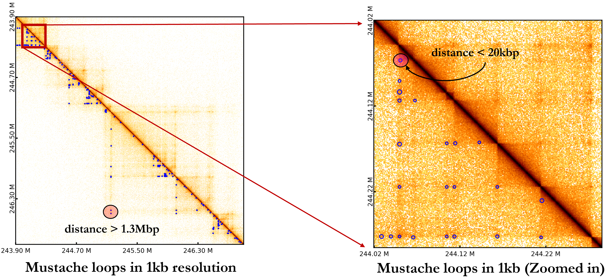

# Mustache  [](https://pypi.org/project/mustache-hic/) [](https://opensource.org/licenses/MIT) [](https://doi.org/10.5281/zenodo.4046958)


Mustache (Multi-scale Detection of Chromatin Loops from Hi-C and Micro-C Maps using Scale-Space Representation) is a tool by Abbas Roayaei Ardakany, Halil Tuvan Gezer, Stefano Lonardi and Ferhat Ay (ferhatay@lji.org).

Mustache is a tool for multi-scale detection of chromatin loops from Hi-C and Micro-C contact maps in high resolutions (10kbp all the way to 500bp and even more). Mustache uses recent technical advances in scale-space theory in Computer Vision to detect chromatin loops caused by interaction of DNA segments with a variable size. Here is an example of Mustache loops detected for HFFc6 Micro-C in 1kb resolution (loops are enlarged):

<p align="center">
  
</p>


For more information, please read the full paper in <a href="https://genomebiology.biomedcentral.com/articles/10.1186/s13059-020-02167-0">Genome Biology</a>. You can also download and visualize our loop calls on Epigenome Browser as a Custom Track Hub using JSON files in the WashU-output folder.

Release notes corresponding to version 1.2.0 (July 16, 2021)
----------------------------------------------------------------
We added differential loop detection to mustache. You can find the differential loops between two contact maps (together with their corresponding loops) by running the following command:
```bash
python3 ./mustache/mustache/diff_mustache.py -f1 data1.hic -f2 data2.hic -pt 0.05 -pt2 0.1 -o output -r 10000 -st 0.8
```
where "pt2" specifies the fdr threshold for finding differential loops. This command will output 4 different files:
1. output.loop1: loops found in data1.hic
2. output.loop2: loops found in data2.hic
3. output.diffloop1: loops that are present in data1.hic and weakened/disappeared in data2.hic
4. output.diffloop2: loops that are present in data2.hic and weakened/disappeared in data1.hic
## Installation

For convenience, we provide several ways to install Mustache.

### Conda

Conda is the recommended way of running Mustache as it will take care of the dependencies.

Suggested way to install conda is to use the installer that is appropriate for your system from the <a href="https://docs.conda.io/en/latest/miniconda.html/">Miniconda</a> page.

Make sure your "conda" command specifically calls the executable under the miniconda distribution (e.g., ~/miniconda3/condabin/conda).

If "conda activate" command gives an error when you run it the first time then you will have to run "conda init bash" once.

```bash
git clone https://github.com/ay-lab/mustache
conda env create -f ./mustache/environment.yml
conda activate mustache
```

and then run one of these three commands:

```
1) python -m mustache  -f ./mustache/data/chr21_5kb.RAWobserved -b ./mustache/data/chr21_5kb.KRnorm -ch 21 -r 5kb -o chr21_out5.tsv -pt 0.1 -st 0.8
2) python3 ./mustache/mustache/mustache.py  -f ./mustache/data/chr21_5kb.RAWobserved -b ./mustache/data/chr21_5kb.KRnorm -ch 21 -r 5kb -o chr21_out5.tsv -pt 0.1 -st 0.8
3) ./mustache/mustache/mustache.py  -f ./mustache/data/chr21_5kb.RAWobserved -b ./mustache/data/chr21_5kb.KRnorm -ch 21 -r 5kb -o chr21_out5.tsv -pt 0.1 -st 0.8
```

### Docker

We have a Docker container that allows running Mustache out of the box. You can <a href="https://docs.docker.com/storage/bind-mounts/">mount</a> the necessary input and output locations and run Mustache as follows.

```bash
docker run -it aylab/mustache
mustache -f /mustache/data/chr21_5kb.RAWobserved -b /mustache/data/chr21_5kb.KRnorm -ch 21 -r 5kb -o ./chr21_out5.tsv -pt 0.1 -st 0.8
```

### PIP

```bash
pip3 install mustache-hic
```

### Github

Make sure you have Python >=3.6 installed, along with all the dependencies listed.

```bash
git clone https://github.com/ay-lab/mustache
cd mustache
./mustache/mustache.py ...arguments
```

### Dependencies

Mustache uses these Python packages:
Check [here](environment.yml) for a list of dependency versions that we know are working with Mustache.

1. python >= 3.6
1. numpy
1. pandas
1. matplotlib
1. seaborn
1. scipy
1. statsmodels
1. pathlib
1. cooler
1. hic-straw

## Examples

#### Example 1: Running Mustache with a contact map and a normalization/bias vector

- Run Mustache on provided example data for chromosome 21 of HMEC cell line from Rao et al. (selected due to file size restrictions) with KR normalization in 5kb resolution as follows.

```bash
mustache -f ./data/chr21_5kb.RAWobserved -b ./data/chr21_5kb.KRnorm -ch 21 -r 5kb -pt 0.1 -o chr21_out.tsv -st 0.8
```

where -f is the raw contact map, -b is the bias (normalization vector) file, -ch is the subject chromosome, -r is the resolution, and -o is the output file.

#### Example 2: Running Mustache with a .hic file

- Acquire the .hic format file for HFFc6 Micro-C from <a href="https://data.4dnucleome.org/files-processed/4DNFIPC7P27B/">4D Nucleome Data Portal</a>. Run Mustache as follows.

```bash
mustache -f ./4DNFIPC7P27B.hic -ch 1 2 X -r 1kb -pt 0.01 -o hic_out.tsv
```

where -f is our input file, -ch is the subject chromosome, -r is the resolution, and -o is the output file.

#### Example 3: Running Mustache with a .cool file

```bash
wget ftp://cooler.csail.mit.edu/coolers/hg19/Rao2014-GM12878-MboI-allreps-filtered.5kb.cool
mustache -f ./Rao2014-GM12878-MboI-allreps-filtered.5kb.cool -ch chr12 chr19 -r 5kb -pt 0.05 -o cooler_out.tsv
OR
mustache -f ./Rao2014-GM12878-MboI-allreps-filtered.5kb.cool -r 5kb -pt 0.05 -o cooler_out.tsv
```

where -f is our input file, -ch is the subject chromosome, -r is the resolution, and -o is the output file. If you don't specify the chromosome (-ch) for a .[m]cool or .hic files mustache will run on all chromosomes and outputs the results in the output file specified by -o.

## Parameters

| Short                 | Long                    | Meaning                                                                                                                     |
| --------------------- | ----------------------- | --------------------------------------------------------------------------------------------------------------------------- |
| _Required Parameters_ |                         |                                                                                                                             |
| **-f**                | **--file**              | Location of contact map. (See below for format.)                                                                            |
| **-r**                | **--resolution**        | Resolution of the provided contact map.                                                                                     |
| **-o**                | **--outfile**           | Name of the output file.                                                                                                    |
| **-ch**                | **--chromosome**            | List of the chromosome names you want to run mustache on. If not specified for .[m]cool or .hic formats mustache will automatically run on all chromosomes.                                            |
| _Optional Parameters_ |                         |                                                                                                                             |
| **-b**                | **--biases**            | Location of biases (normalization) file for contact map (required only for text format).                                             |
| **-p**                | **--processes**         | Number of parallel processes to run. Default is 4. Increasing this will also increase the memory usage.                     |
| **-pt**               | **--pThreshold**        | P-Value threshold for an interaction to be reported in the final output file. Default is 0.1                                |
| **-sz**               | **--sigmaZero**         | Sigma0 parameter for Mustache. Default is experimentally chosen for 5Kb resolution.                                         |
| **-st**               | **--sparsityThreshold** | The sparsity threshold mustache uses tp filter out loops in sparse regions. Default value is 0.88. |
| **-norm**               | **--normalization**         | For .[m]cool or .hic files, you can specify what normalization mustache should use (-norm KR). For .[m]cool files, by default, mustache assumes that bias values are stored in the 'weight' column when this parameter is not specified. For .hic format, the default is 'KR' normalization if not specified.|
| **-V**                | **--version**           | Shows the version of the tool.                                                                                              |
#### Tips
- For sparser datasets use smaller sparsity thresholds , e.g., -st 0.7 (default=0.88).
- For very high resolutions (e.g., 1kb) use:
  - smaller sparsity thresholds , e.g., -st 0.7
  - less stringnet q-value thresholds, e.g., -pt 0.1
## Input Formats

Input map can be one of the following types.

### 1. Text format (contact counts file + bias file)

Similar to Hi-C analysis tools previously developed by our lab (<a href="https://github.com/ay-lab/selfish">Selfish</a> and <a href="https://github.com/ay-lab/fithic">FitHiC</a>), we allow a simple, readable textual input format for Mustache.

To use this input mode, we require a contact map and a bias/normalization vector file.

##### 1a. Contact map files need to have the following format. They must not have a header. The values must be separated by a tab.

| Chromosome 1 | Midpoint 1 | Chromosome 2 | Midpoint 2 | Contact Count |
| ------------ | ---------- | ------------ | ---------- | ------------- |
| chr1         | 5000       | chr1         | 65000      | 438           |
| chr1         | 5000       | chr1         | 85000      | 12            |
| ...          | ...        | ...          | ...        | ...           |

##### 1b. Bias files need to have the following format. They must not have a header. Bias file must use the same midpoint format as the contact maps.

Bias file is a list of normalization factors. This means contact counts will be _divided_ by their corresponding factors.

| Chromosome | Midpoint | Factor |
| ---------- | -------- | ------ |
| chr1       | 5000     | NaN    |
| chr1       | 10000    | 1.12   |
| chr1       | 15000    | 0.1    |

### 2. Juicer .hic Files

Mustache uses <a href="https://github.com/aidenlab/straw">Juicer's</a> straw tool to read .hic files.

### 3. Cooler .cool, and .mcool Files

Mustache uses <a href="https://github.com/mirnylab/cooler">Cooler package to read .cool, and .mcool files.</a>

## Output format

Output of Mustache is a TSV file and is formatted as follows

`| Bin 1 Chromosome | Bin 1 Start | Bin 1 End | Bin 2 Chromosome | Bin 2 Start | Bin 2 End | FDR | Mustache Scale for this Detection |`

## Citation

If you use Mustache in your work, please cite our <a href="https://genomebiology.biomedcentral.com/articles/10.1186/s13059-020-02167-0">paper</a>:

##### Roayaei Ardakany, A., Gezer, H.T., Lonardi, S. et al. Mustache: multi-scale detection of chromatin loops from Hi-C and Micro-C maps using scale-space representation. Genome Biol 21, 256 (2020). https://doi.org/10.1186/s13059-020-02167-0

## Contact

For problems about installation, technical questions, parameter settings, interpretation of the results and other help please email Abbas Roayaei Ardakany or Ferhat Ay (abbas@lji.org, ferhatay@lji.org).
